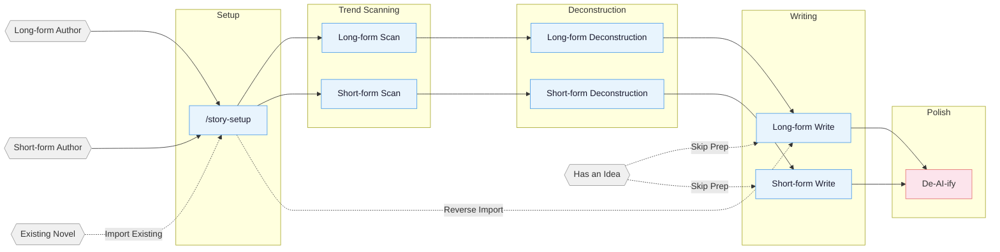

<!-- Last synced with README.md: 2026-05-21 -->

**English** | [中文](README.md)

# oh-story-claudecode

A web novel writing skill pack for Claude Code and OpenClaw. Covers the full pipeline for long-form and short-form Chinese web novels: trend scanning, deconstruction, writing, AI tone removal, and cover generation.

## Core Approach

> **Tropes = deterministic emotional payoff**

Professional authors follow a three-step method: 1. Scan — analyze trending charts, identify genres, characters, and entry points. 2. Deconstruct — break down pacing and plot materials, build a personal module library. 3. Commercialize — learn and apply hooks, payoff density, expectation management.

Built around four pillars: reverse-engineering hits, plot modularization, layered state management, and human-AI collaboration.

## Pipeline Overview



## Installation

**Option 1** Tell Claude Code / OpenClaw directly:

```
Install this skill https://github.com/worldwonderer/oh-story-claudecode
```

**Option 2** Command line:

```bash
npx skills add worldwonderer/oh-story-claudecode -y
```

Re-run the same command to update.

## Skills

| Skill | Trigger | Description |
|:------|:--------|:------------|
| `story-setup` | `/story-setup` | Environment setup — deploys hooks/rules/agents/CLAUDE.md in one click |
| `story` | `/story` | Toolbox router — routes fuzzy intents to the matching skill |
| `story-long-write` | `/story-long-write` | Long-form writing — outline building, character design, prose output |
| `story-long-analyze` | `/story-long-analyze` | Long-form deconstruction — Golden First 3 Chapters, payoff design, pacing analysis |
| `story-long-scan` | `/story-long-scan` | Long-form trend scan — Qidian/Fanqie/Jinjiang market trends |
| `story-short-write` | `/story-short-write` | Short-form writing — emotion design, twist crafting, polish & delivery |
| `story-short-analyze` | `/story-short-analyze` | Short-form deconstruction — story core, structure, emotional arc, reversal design, writing techniques, resonance analysis |
| `story-short-scan` | `/story-short-scan` | Short-form trend scan — Zhihu Yanayan/Fanqie short-form trending data |
| `story-deslop` | `/story-deslop` | De-AI-ify — detect and remove AI writing traces |
| `story-import` | `/story-import` | Reverse import — parse existing novels into standard project structure |
| `story-review` | `/story-review` | Multi-perspective review — 4-agent adversarial review + Fanqie/Qidian/Zhihu scoring rubrics |
| `story-cover` | `/story-cover` | Cover generation — title & genre analysis + GPT-Image-2 image generation |
| `browser-cdp` | `/browser-cdp` | Browser control — CDP protocol for scraping with reusable login sessions |

Natural language also triggers: `帮我开书` ("help me start writing") → `story-long-write`, `这篇太AI了` ("this is too AI-ish") → `story-deslop`, `把我的书导进来` ("import my book") → `story-import`, `沈栀现在什么状态` ("what's Shen Zhi's current status") → `story-explorer`.

<details>
<summary>Cover generation example</summary>


</details>

<details>
<summary>Deconstruction demo — Coiling Dragon</summary>

Full output from `/story-long-analyze` deep mode on the first 23 chapters of *Coiling Dragon*:

```
demo/拆文库-盘龙/
├── 概要.md              # Novel overview + chapter index
├── 拆文报告.md           # 5-dimension scoring + pacing analysis + takeaways
├── 章节/
│   ├── 第1章_深度拆解.md  # Golden三章 deep analysis
│   └── 第1-23章_摘要.md   # Per-chapter summary + plot points + character mentions
├── 角色/
│   ├── 林雷.md           # Protagonist full profile
│   ├── 霍格.md           # Core supporting
│   ├── 希尔曼.md         # Core supporting
│   ├── 德林柯沃特.md      # Core supporting
│   ├── 沃顿.md           # Functional character
│   └── 角色关系.md        # Relationship network
├── 剧情/
│   └── 故事线.md          # Framework + 4 plotlines + 2 storylines
└── 设定/
    ├── 世界观.md          # Power system + geography + factions
    └── 金手指.md          # Panlong Ring + Delin Cowort
```

</details>

## Agent System

Writing skills internally coordinate 7 specialized agents:

| Agent | Model | Role |
|:------|:------|:-----|
| **story-architect** | Opus | Story architecture — genre positioning, outline structure, hook/twist design, emotion arcs |
| **character-designer** | Sonnet | Character design — profiles, voice, motivation chains, dialogue writing |
| **narrative-writer** | Sonnet | Narrative writer — prose writing, de-AI-ify, format compliance |
| **consistency-checker** | Haiku | Consistency check — fact conflict scanning, foreshadowing tracking, S1-S4 grading reports |
| **story-researcher** | Sonnet | Research — CDP search + full-text extraction, multi-source cross-verification, structured reference files |
| **story-explorer** | Haiku | Story query — read-only character/foreshadowing/setting/progress lookup, quick context loading |
| **chapter-extractor** | Haiku | Chapter extraction — summaries, plot points, character mentions, parallel deconstruction unit |

Agents load writing theory from `references/` on demand (character design, dialogue techniques, twist toolbox, etc. — 100+ methodology files), without reserving context window space.

## Upgrading to v0.6.6

If you have already run `/story-setup` inside a writing project, run `/story-setup` again from the project root after updating this skill pack.

This release bumps `agents_version` to v7 and focuses on reducing token blow-ups in 40+ chapter daily long-form writing projects:

- After `/story-long-write 日更` enters the daily batch flow, same-batch “continue / rewrite / daily write” requests stay inside `workflow-daily.md` instead of jumping directly to prose writing.
- Before each chapter, the workflow must read concrete project files from the current run: chapter outline, previous chapter prose, `追踪/上下文.md`, `追踪/伏笔.md`, `追踪/时间线.md`, and character status/settings.
- The SessionStart hook now warns only for `已过期` or abnormal foreshadowing states; normal open states (`未埋` / `已埋`) no longer trigger full foreshadowing audits.
- Daily writing only handles incremental foreshadowing changes for the current batch; run `/story-review` explicitly when you need a full audit.

## Automation Hooks

6 hooks deployed automatically by `/story-setup`:

| Hook | Trigger | Function |
|:-----|:---------|:---------|
| session-start.sh | Session start | Display branch, progress snapshot, deconstruction status |
| session-end.sh | Session end | Log session to `追踪/session-log.txt` |
| detect-story-gaps.sh | Session start | Detect setting gaps, missing outlines, foreshadowing breaks |
| pre-compact.sh | Before context compaction | Save progress snapshot path and line-count summary |
| post-compact.sh | After context compaction | Prompt to read progress snapshot for context recovery |
| validate-story-commit.sh | git commit | Check hardcoded attributes, setting required fields (warning only, non-blocking) |

## Project File Structure

A long-form novel can easily reach hundreds of thousands of words across hundreds of chapters. Setting conflicts, broken foreshadowing, timeline inconsistencies — relying on memory alone is a recipe for disaster.

The file system separates settings, outlines, prose, and tracking into independent dimensions. The conversation handles creation; the file system handles memory.

**Long-form:**

```
{Book Title}/
├── Settings/
│   ├── World/              # Background, power systems, etc. — one file per topic
│   ├── Characters/         # One file per character (Shen_Zhi.md, Lu_Yanzhi.md)
│   ├── Factions/           # One file per faction/organization (Tianji_Pavilion.md)
│   ├── Relationships.md    # Character relationship map
│   └── Genre_Positioning.md # Core trope + benchmark analysis
├── Outline/
│   ├── Outline.md          # Full-book volume-level structure
│   ├── Volume_1.md         # One per volume: payoff pacing + emotion arc + character arc + foreshadowing + twists
│   ├── Chapter_001.md      # One per chapter: events + hooks + payoffs + suspense
│   └── ...
├── Prose/
│   ├── Chapter_001_Title.md
│   └── ...
├── Benchmark/                # Benchmark reference (structured subdirs synced from deconstruction)
│   └── {Benchmark Book}/
│       ├── Source/              # Benchmark book original chapters
│       ├── Characters/         # Structured character profiles (synced from analyze)
│       ├── Plotlines/          # Structured plot lines (synced from analyze)
│       ├── Settings/           # Structured world settings (synced from analyze)
│       └── Report.md            # Analyze skill output
├── Tracking/                # Continuity management (layered tracking)
│   ├── Context.md           # Writing context (for compact recovery)
│   ├── Foreshadowing.md     # Foreshadowing planted/resolved status table (cross-volume)
│   ├── Timeline.md          # In-story timeline (full-book)
│   └── Character_Status.md  # Character current state snapshots (per-chapter)
├── References/              # story-researcher output
│   └── {topic}.md           # Split by research topic
```

**Short-form file structure:**

```
{Book Title}/
├── Prose.md                  # Complete short-form prose
├── Section_outline.md        # Per-section outline (emotion + hooks + events)
├── Self-check.md             # Post-writing self-check record
└── References/               # Writing references
    └── {topic}.md
```

**Deconstruction Library:** Deconstruction skills save structured outputs (characters, plotlines, settings, chapters) under `拆文库/{Book Title}/` at project root. Writing skills consume these assets through the `Benchmark/` subdirectory, or automatically fall back to reading from the deconstruction library.

## Knowledge Base

Each skill includes a `references/` knowledge base loaded on demand to keep context lean.

| Topic | Contents | Skill |
|:------|:---------|:------|
| Outline Layout | Five-step outline method · Story structure levels · Node design · Progression design | long-write |
| Opening Design | Opening patterns · First 500 words · Golden First 3 Chapters | long-write / short-write |
| Character Design | Character profiles · Character extraction · Relationship mapping · Motivation chains · Ensemble casts | long-write / short-write / short-analyze |
| Hook Techniques | 13 chapter-end hooks · 7 chapter-start hooks · Paragraph-level hooks · Suspense orchestration | long-write / short-write / short-analyze |
| Emotion Design | 6 arc templates · Expectation management · Genre track strategies | long-write / short-write |
| Genre Frameworks | Long-form 8-node · Short-form compressed 3-act · 8 genre opening templates | long-write / short-write / short-analyze |
| Dialogue Techniques | Rhythm · Subtext · Information control · Dialogue pattern database | long-write / short-write |
| Twist Toolbox | Types · Timing · Misdirection base paths | long-write / short-write |
| Style Modules | Dialogue · Combat · Mind games · Cinematic writing · Face-slapping · Plain description | long-write |
| Advanced Techniques | 4-step micro-outline · Climax reverse-engineering · Dual-thread structure · AB interweaving | long-write |
| De-AI-ify | Prevention · 3-pass de-AI method · Rewrite examples · Banned word list | deslop / long-write / short-write |
| Quality Checks | General · Long-form specific · Short-form specific · Toxic trope detection | long-write / short-write / short-analyze |
| Writing Formulas | 21 genre formulas · Three-flip-four-shock (escalating reversal) · Romance four-stage | short-write / short-analyze |
| Female-oriented Writing | Female reader preferences · Emotional description · Romance patterns · Benchmark analysis | short-write |
| Deconstruction Methods | Golden First 3 Chapters · Emotion curves · Structure breakdown · Zhihu style analysis | long-analyze / short-analyze |
| Short-form Methodology | Story core · Plot nodes · Explosive point analysis · Writing techniques · Rhythm analysis · Resonance analysis · Character classification · Platform fit | short-analyze |
| Deconstruction Examples | Full case breakdowns · Template output | short-analyze |
| Reader Profiles | 9-dimension profiles · Target reader analysis | long-scan |
| Market Data | Genre trends · Platform characteristics · Collection formats · Submission guides | long-scan / short-scan |
| Cover Styles | 10 genre visual styles · Color composition · Prompt templates | story-cover |
| Adversarial Review | Multi-perspective review · Scoring rubrics · Toxic trope detection | story-review |

## Supported Platforms

**Long-form** Qidian (起点中文网) · Fanqie Novels (番茄小说) · Jinjiang (晋江文学城) · Qimao (七猫小说) · Ciweimao (刺猬猫)

**Short-form** Zhihu Yanayan (知乎盐言故事) · Fanqie Short-form (番茄短篇) · Qimao Short-form (七猫短篇)

I built this skill pack to help me through a job-hunting transition :joy:, and I hope it can help others too.

## Star History

<a href="https://www.star-history.com/?repos=worldwonderer%2Foh-story-claudecode&type=date&legend=top-left">
 <picture>
   <source media="(prefers-color-scheme: dark)" srcset="https://api.star-history.com/chart?repos=worldwonderer/oh-story-claudecode&type=date&theme=dark&legend=top-left" />
   <source media="(prefers-color-scheme: light)" srcset="https://api.star-history.com/chart?repos=worldwonderer/oh-story-claudecode&type=date&legend=top-left" />
   
 </picture>
</a>

## Contributing

Contributions are welcome — new skills, knowledge base additions, market data updates. See [CONTRIBUTING.md](CONTRIBUTING.md) (Chinese only).

## Acknowledgments

- [LINUX DO - The New Ideal Community](https://linux.do) — Community support
- [FanqieRankTracker](https://github.com/wen1701/FanqieRankTracker) — Fanqie Novels font obfuscation decoding reference
